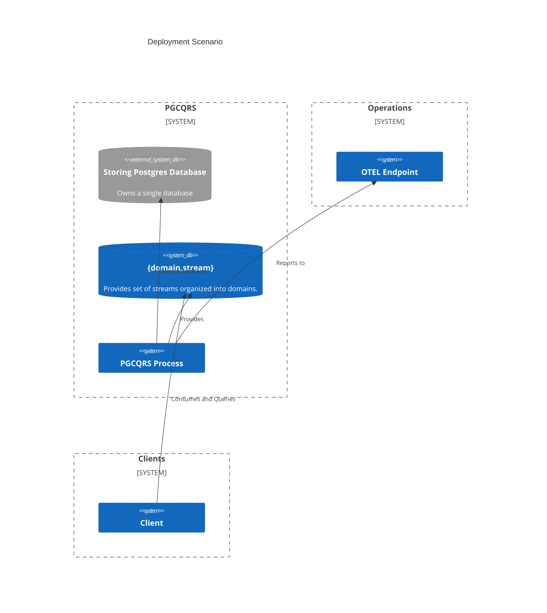

# Postgres Command Query Responsibility Segregation
PGCQRS proxies a Postgres database providing a set of streams containing store-time ordered JSON events.  Event streams
may be queried for a subset of matching events or all events.  Streams exist in domain namespaces and an instance has
multiple domains.

## Features
Really simple, honestly.
* Stores all events into Postgres
* Separate streams for each application
* TLS
* OTEL instrumented

## Deployment Scenarios
PGCQRS requires a Postgres database and should be considered the sole owner.  PGCQRS will provide multiple {`domain`, `stream`}
event sets for client applications.

## Usage in production
Currently the following are not implemented which would be required for the system to be 'production ready':
* Security: Authentication and Authorization.

### Setup
Run the migrator using `migrator primary` with the proper credentials.  Then you may start the service.

## Releases History
* v0.7.0 (not released yet) - Removes `kind` column.  Results in smaller database, faster inserts and queries.  Upgraded dependencies.
* v0.6.0 - batch query version 2
